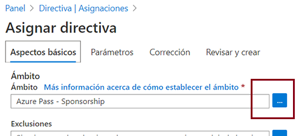
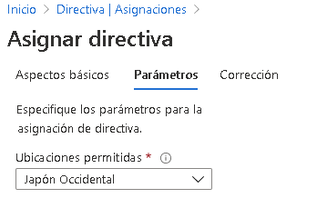
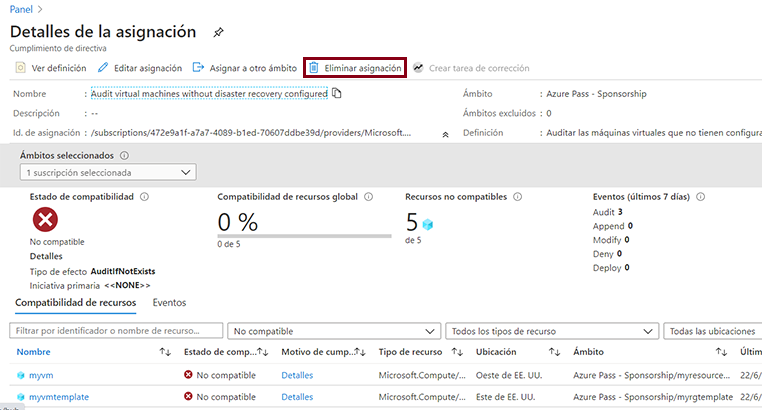

---
wts:
    title: '14: Creación de una directiva de Azure'
    module: 'Módulo 03: Seguridad, privacidad, cumplimiento y confianza'
---
# 14: Crear una directiva de Azure

En este tutorial crearemos una directiva de Azure para restringir la implementación de los recursos de Azure en una ubicación específica.

# Tarea 1: Crear una asignación de directiva

En esta tarea, configuraremos la política de ubicación permitida y la asignaremos a nuestra suscripción. 

1. Inicie sesión en [Azure Portal](https://portal.azure.com).

2. Desde la hoja **Todos los servicios**, busque y seleccione **Política**, bajo la sección **Creación**, haga clic en **Definiciones**.  Tómese un momento para revisar la lista de definiciones de las directivas integradas. Por ejemplo, en el menú desplegable **Categoría** seleccione solo **Calcular**. Tenga en cuenta que la definición **SKU de máquinas virtuales permitidas** le habilita especificar un conjunto de SKU de máquinas virtuales que su organización puede implementar.

3. Vuelva a la página **Directiva**, en la sección **Creación** y haga clic en **Asignaciones**. Una asignación es una directiva que se ha asignado para que tenga lugar dentro de un alcance específico. Por ejemplo, se podría asignar una definición al ámbito de la suscripción. 

4. Haga clic en **Asignar directiva** en la parte superior de la página **Directiva: Asignaciones**.

5. En la página **Asignar política**, seleccione el selector de Ámbito haciendo clic en los puntos suspensivos.

    

6. Asegúrese de que su suscripción esté seleccionada. El nombre de su suscripción puede ser diferente. Tenga en cuenta que, opcionalmente, puede definir el ámbito de la directiva a un grupo de recursos. Deje los valores predeterminados y haga clic en **Seleccionar**. 

    **Nota**: Un ámbito determina a qué recursos o agrupación de recursos se aplica la asignación de directiva. En nuestro caso, podríamos asignar esta directiva a un grupo de recursos específico. Sin embargo, elegimos asignar la directiva en el nivel de suscripción. Tenga en cuenta que los recursos se pueden excluir en función de la configuración del ámbito. Las exclusiones son opcionales.

    

7. Seleccione el botón de puntos suspensivos **Definición de directiva**. En el cuadro **Buscar** escriba **ubicación**, haga clic en la definición **Ubicaciones permitidas** y luego en **Seleccionar**.

    **Nota**: Esta definición de directiva de **Ubicaciones permitidas** especificará una ubicación en la que se deben implementar todos los recursos. Si se elige una ubicación diferente, no se permitirá la implementación. Para obtener más información, vea la página [Muestras de política de Azure](https://docs.microsoft.com/es-es/azure/governance/policy/samples/index).

   

8.  En el panel **Asignar directiva**, cambie a la pestaña **Parámetros**, haga clic en la flecha al final del cuadro **Ubicaciones permitidas** y de la siguiente lista elija **Japón Occidental**. Deje todos los demás valores como están y haga clic en **Revisar + crear**, y luego en **Crear**.

    

9. La asignación de política de **Ubicaciones permitidas** ahora aparece en el panel **Política: Asignaciones** y ahora está implementada, aplicando la política en el nivel de alcance que especificamos (nivel de suscripción).

# Tarea 2: Prueba de la directiva de Ubicación permitida

En esta tarea probaremos la directiva de Ubicación permitida. 

1. En el Azure Portal, desde la hoja **Todos los servicios**, busque y seleccione **Cuentas de almacenamiento** y luego haga clic en **+ Añadir**.

2. Configure la cuenta de almacenamiento (reemplace **xxxx** en el nombre de la cuenta de almacenamiento con letras y dígitos de modo que el nombre sea único a nivel global). Deje los valores predeterminados para todo lo demás. 

    | Valor | Valor | 
    | --- | --- |
    | Suscripción | **Use su suscripción** |
    | Grupo de recursos | **myRGPolicy** (crear nuevo) |
    | Nombre de la cuenta de almacenamiento | **storageaccountxxxx** |
    | Ubicación | **Este de EE. UU.** |
    | | |

3. Haga clic en **Revisar + crear** y luego haga clic en **Crear**. 

4. Recibirá el error de implementación fallida que indica que la directiva rechazó el recurso, incluido el nombre de la directiva de **Ubicaciones permitidas**.

# Tarea 3: Elimine la asignación de directiva

En esta tarea, quitaremos la asignación y prueba de la directiva de ubicación permitida. 

Eliminaremos la asignación de directivas para asegurarnos de que no estemos bloqueados en ningún trabajo futuro que deseemos hacer.

1. Desde la hoja **Todos los servicios**, busque y seleccione **Directiva** y luego haga clic en la directiva **Ubicaciones permitidas**.

    **Nota**: En la hoja **Directiva** puede ver el estado de cumplimiento de las diversas directivas que ha asignado.

    **Nota**: La política de ubicación permitida puede mostrar recursos no compatibles. Si es así, estos son recursos creados antes de la asignación de la política.

2. Haga clic en **Eliminar asignación** en el panel superior.

   

3. Confirme que desea eliminar la asignación de directiva en el diálogo **Eliminar asignación** haciendo clic en **Sí**

4. Trate de crear otra cuenta de almacenamiento para asegurarse de que la directiva ya no está vigente.

    **Nota**: Entre las situaciones comunes donde la directiva de **Ubicaciones permitidas** puede ser útil se incluyen las siguientes: 
    - *Seguimiento de costes*: Podría tener diferentes suscripciones para diferentes ubicaciones regionales. La directiva garantizará que todos los recursos se implementen en la región prevista para ayudar con el seguimiento de costes. 
    - *Cumplimiento de Seguridad y residencia de datos*: También podría tener requisitos de residencia de datos, crear suscripciones por cliente o carga de trabajo específica y definir que todos los recursos deban implementarse en un centro de datos particular para garantizar los requisitos de cumplimiento de seguridad y datos.

¡Enhorabuena! Ha creado una directiva de Azure para restringir la implementación de los recursos de Azure en un centro de datos particular.

**Nota**: Para evitar costes adicionales, puede eliminar este grupo de recursos. Busque grupos de recursos, haga clic en su grupo de recursos y, a continuación, haga clic en **Eliminar grupo de recursos**. Compruebe el nombre del grupo de recursos y luego haga clic en **Eliminar**. Supervise las **Notificaciones** para ver cómo se realiza la eliminación.